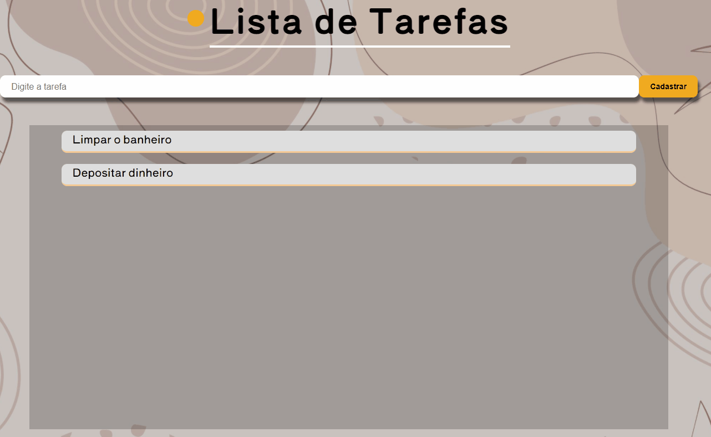

<h1 align="center">Lista de Tarefas</h1>

<h2 align="center">Sobre o projeto</h2>

Essa lista de tarefa possibilita a inclusão e exclusão de novas tarefas. Sempre que algo é adicionado ou retirado, automaticamente as tarefas são atualizadas no local storage do navegador, ou seja, mesmo fechando a página as tarefas ainda continuarão salvas.

<h2>
    
</h2>

<h2 align="center">Construído com</h2>

- HTML5 semântico
- CSS3
- JavaScript
- Media queries

<h2 align="center">Site para utilização</h2>
<a href="https://lista-de-tarefas-to-do.netlify.app/" target="_blank" >Clique aqui</a>
  

<h3>Made with :heart: by Elivelton</h3>
